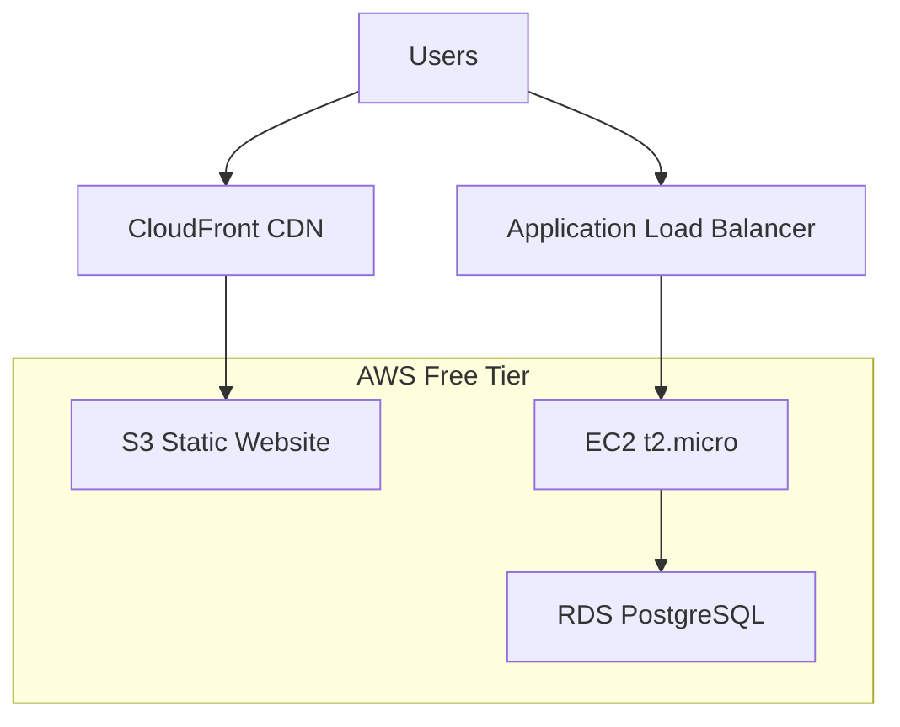

# 💰 AWS Free Tier Setup Guide

## ✅ **Perfect for AWS Free Tier!**

Yes, AWS Free Tier is **absolutely perfect** for getting started with our SAP clone! I've optimized the infrastructure to maximize your free tier benefits while keeping costs at **$0/month** for the first year.

## 🆓 **What You Get FREE for 12 Months**

### **🖥️ EC2 (Backend API)**
- **750 hours/month** of t2.micro instances
- **1 vCPU, 1GB RAM** - perfect for .NET 9 API
- **30GB EBS storage** included
- **Cost**: **$0/month** ✅

### **🗂️ S3 (Frontend Hosting)**
- **5GB storage** for React build files
- **20,000 GET requests**
- **2,000 PUT requests**
- **Cost**: **$0/month** ✅

### **🌐 CloudFront (CDN)**
- **1TB data transfer** per month
- **10,000,000 HTTP requests**
- Global edge locations
- **Cost**: **$0/month** ✅

### **🗄️ RDS (Database)**
- **750 hours/month** of db.t2.micro
- **20GB SSD storage**
- **PostgreSQL 15** fully managed
- **Cost**: **$0/month** ✅

## 🏗️ **Free Tier Architecture**



## 🚀 **Setup Instructions**

### **1. 🖥️ EC2 Instance Setup**

#### **Launch t2.micro Instance**
```bash
# 1. Go to EC2 Console
# 2. Launch Instance
# 3. Choose: Ubuntu Server 22.04 LTS (Free tier eligible)
# 4. Instance type: t2.micro (Free tier eligible)
# 5. Create new key pair for SSH
# 6. Security group: Allow SSH (22), HTTP (80), HTTPS (443), Custom (5000)
```

#### **Install Dependencies**
```bash
# SSH into your instance
ssh -i your-key.pem ubuntu@your-ec2-ip

# Update system
sudo apt update && sudo apt upgrade -y

# Install .NET 9
wget https://packages.microsoft.com/config/ubuntu/22.04/packages-microsoft-prod.deb -O packages-microsoft-prod.deb
sudo dpkg -i packages-microsoft-prod.deb
sudo apt update
sudo apt install -y dotnet-sdk-9.0

# Install PostgreSQL
sudo apt install -y postgresql postgresql-contrib

# Install Nginx (reverse proxy)
sudo apt install -y nginx

# Install certbot for SSL
sudo apt install -y certbot python3-certbot-nginx
```

#### **Configure PostgreSQL**
```bash
# Switch to postgres user
sudo -u postgres psql

# Create database and user
CREATE DATABASE sapclone;
CREATE USER sapuser WITH ENCRYPTED PASSWORD 'your-secure-password';
GRANT ALL PRIVILEGES ON DATABASE sapclone TO sapuser;
\q

# Update PostgreSQL configuration
sudo nano /etc/postgresql/14/main/postgresql.conf
# Uncomment: listen_addresses = 'localhost'

sudo systemctl restart postgresql
```

### **2. 🗂️ S3 Static Website Setup**

#### **Create S3 Bucket**
```bash
# Create bucket (replace with your domain)
aws s3 mb s3://your-sap-clone-frontend

# Enable static website hosting
aws s3 website s3://your-sap-clone-frontend \
  --index-document index.html \
  --error-document index.html

# Set bucket policy for public read
cat > bucket-policy.json << EOF
{
  "Version": "2012-10-17",
  "Statement": [
    {
      "Sid": "PublicReadGetObject",
      "Effect": "Allow",
      "Principal": "*",
      "Action": "s3:GetObject",
      "Resource": "arn:aws:s3:::your-sap-clone-frontend/*"
    }
  ]
}
EOF

aws s3api put-bucket-policy \
  --bucket your-sap-clone-frontend \
  --policy file://bucket-policy.json
```

### **3. 🌐 CloudFront Distribution**

#### **Create Distribution**
```bash
# Create CloudFront distribution
aws cloudfront create-distribution \
  --distribution-config '{
    "CallerReference": "'$(date +%s)'",
    "Origins": {
      "Quantity": 1,
      "Items": [
        {
          "Id": "S3-your-sap-clone-frontend",
          "DomainName": "your-sap-clone-frontend.s3.amazonaws.com",
          "S3OriginConfig": {
            "OriginAccessIdentity": ""
          }
        }
      ]
    },
    "DefaultCacheBehavior": {
      "TargetOriginId": "S3-your-sap-clone-frontend",
      "ViewerProtocolPolicy": "redirect-to-https",
      "TrustedSigners": {
        "Enabled": false,
        "Quantity": 0
      },
      "ForwardedValues": {
        "QueryString": false,
        "Cookies": {
          "Forward": "none"
        }
      },
      "MinTTL": 0
    },
    "Comment": "SAP Clone Frontend",
    "Enabled": true
  }'
```

### **4. 🔧 Systemd Service for API**

#### **Create Service File**
```bash
sudo nano /etc/systemd/system/sap-api.service
```

```ini
[Unit]
Description=SAP Clone API
After=network.target

[Service]
Type=notify
User=ubuntu
WorkingDirectory=/opt/sap-api
ExecStart=/usr/bin/dotnet SAP.API.dll
Restart=always
RestartSec=10
Environment=ASPNETCORE_ENVIRONMENT=Production
Environment=ASPNETCORE_URLS=http://localhost:5000
Environment="ConnectionStrings__DefaultConnection=Host=localhost;Database=sapclone;Username=sapuser;Password=your-secure-password"

[Install]
WantedBy=multi-user.target
```

```bash
# Enable and start service
sudo systemctl daemon-reload
sudo systemctl enable sap-api
sudo systemctl start sap-api
```

### **5. 🌐 Nginx Configuration**

```bash
sudo nano /etc/nginx/sites-available/sap-clone
```

```nginx
server {
    listen 80;
    server_name your-domain.com;

    # API proxy
    location /api/ {
        proxy_pass http://localhost:5000/;
        proxy_http_version 1.1;
        proxy_set_header Upgrade $http_upgrade;
        proxy_set_header Connection 'upgrade';
        proxy_set_header Host $host;
        proxy_set_header X-Real-IP $remote_addr;
        proxy_set_header X-Forwarded-For $proxy_add_x_forwarded_for;
        proxy_set_header X-Forwarded-Proto $scheme;
        proxy_cache_bypass $http_upgrade;
    }

    # Health check
    location /health {
        proxy_pass http://localhost:5000/health;
    }
}
```

```bash
# Enable site
sudo ln -s /etc/nginx/sites-available/sap-clone /etc/nginx/sites-enabled/
sudo nginx -t
sudo systemctl restart nginx

# Get SSL certificate
sudo certbot --nginx -d your-domain.com
```

## 💡 **Cost Optimization Tips**

### **🔋 Stay Within Free Tier**
- **Monitor usage** in AWS Cost Explorer
- **Set billing alerts** at $1, $5, $10
- **Use t2.micro only** (never upgrade instance size)
- **Keep RDS under 20GB**
- **Monitor S3 requests**

### **⚡ Performance Optimization**
```bash
# .NET 9 optimization
export DOTNET_TieredPGO=1
export DOTNET_TC_QuickJitForLoops=1
export DOTNET_ReadyToRun=0

# PostgreSQL tuning for 1GB RAM
sudo nano /etc/postgresql/14/main/postgresql.conf
```

```ini
# Optimized for t2.micro (1GB RAM)
shared_buffers = 256MB
effective_cache_size = 768MB
maintenance_work_mem = 64MB
checkpoint_completion_target = 0.9
wal_buffers = 16MB
default_statistics_target = 100
random_page_cost = 1.1
```

## 📊 **Monitoring & Alerts**

### **AWS Billing Alerts**
```bash
# Create billing alarm
aws cloudwatch put-metric-alarm \
  --alarm-name "AWS-Free-Tier-Usage" \
  --alarm-description "Alert when approaching free tier limits" \
  --metric-name EstimatedCharges \
  --namespace AWS/Billing \
  --statistic Maximum \
  --period 86400 \
  --threshold 1 \
  --comparison-operator GreaterThanThreshold
```

### **Application Monitoring**
```bash
# Install htop for monitoring
sudo apt install htop

# Check resource usage
htop
df -h
free -h
sudo systemctl status sap-api
sudo systemctl status postgresql
```

## 🚀 **Deployment Secrets**

Add these to your GitHub repository secrets:

```bash
# AWS Configuration
AWS_ACCESS_KEY_ID=your-access-key
AWS_SECRET_ACCESS_KEY=your-secret-key
AWS_REGION=us-east-1

# S3 & CloudFront
S3_BUCKET_NAME=your-sap-clone-frontend
CLOUDFRONT_DISTRIBUTION_ID=your-distribution-id
CLOUDFRONT_DOMAIN=your-distribution-domain.cloudfront.net

# EC2 SSH Access
EC2_HOST=your-ec2-public-ip
EC2_USER=ubuntu
EC2_SSH_KEY=your-private-key-content
```

## 💰 **Expected Monthly Costs**

### **First 12 Months: $0**
- EC2 t2.micro: **FREE** (750 hours)
- RDS t2.micro: **FREE** (750 hours)
- S3 storage: **FREE** (5GB)
- CloudFront: **FREE** (1TB transfer)
- **Total: $0/month** ✅

### **After Free Tier (Month 13+)**
- EC2 t2.micro: **~$8.50/month**
- RDS t2.micro: **~$15/month**
- S3 storage: **~$0.50/month**
- CloudFront: **~$1/month**
- **Total: ~$25/month** 💰

## 🎯 **Perfect for Development!**

This setup gives you:
- **Production-ready** infrastructure
- **Global CDN** with CloudFront
- **Managed database** with RDS
- **SSL certificates** with Let's Encrypt
- **Zero cost** for first year
- **Automatic deployments** with GitHub Actions

You can develop and test your SAP clone **completely free** for 12 months, then scale up as needed! 🚀 