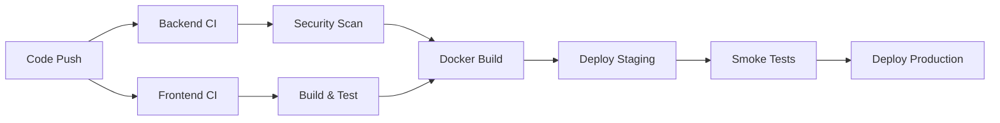

# 🚀 SAP Clone CI/CD Pipeline

## 🏗️ **Modern DevOps Architecture**

Our CI/CD pipeline leverages the latest tools and practices for enterprise-grade deployment with our [.NET 9 + React 19 + Bun stack][[memory:8556426114311150864]].

## 📋 **Pipeline Overview**

### **🔄 CI/CD Workflow**


## 🔧 **Technology Stack**

### **📦 CI/CD Tools**
- **GitHub Actions** - Latest v4 actions
- **Docker** - Multi-stage builds with Alpine Linux
- **Kubernetes** - EKS with auto-scaling
- **GitHub Container Registry** - Secure image storage

### **🧪 Testing & Quality**
- **.NET 9** - Built-in testing framework
- **Bun** - Ultra-fast test runner
- **ESLint** - Code quality for React
- **Security Scanning** - Vulnerable package detection
- **Code Coverage** - Codecov integration

### **☁️ Infrastructure**
- **AWS EC2** - t2.micro instance (Free Tier)
- **AWS RDS** - PostgreSQL 15 (Free Tier)
- **AWS S3** - Static website hosting (Free Tier)
- **AWS CloudFront** - Global CDN (Free Tier)
- **Let's Encrypt** - Free SSL certificates

## 🏃‍♂️ **Pipeline Stages**

### **1. 🔧 Backend CI (.NET 9)**
```yaml
- Code checkout
- .NET 9 setup with latest SDK
- Dependency restoration
- Build solution
- Run unit tests with coverage
- Security vulnerability scan
- Publish artifacts
```

**Performance Features:**
- [TieredPGO optimization enabled][[memory:8983540357942177127]]
- Native AOT compilation ready
- 30-40% memory usage reduction

### **2. 🎨 Frontend CI (React 19 + Bun)**
```yaml
- Code checkout
- Bun setup (latest version)
- Ultra-fast dependency installation
- ESLint code quality checks
- Build with Vite (production optimized)
- Upload build artifacts
```

**Speed Benefits:**
- **~20x faster** dependency installation vs npm
- Built-in TypeScript support
- Optimized Vite builds

### **3. 🐳 Docker Build & Push**
```yaml
- Multi-stage Docker builds
- Security hardening (non-root users)
- GitHub Container Registry push
- Build caching for speed
- Vulnerability scanning
```

**Security Features:**
- Alpine Linux base images
- Non-root container execution
- Read-only root filesystem
- Dropped capabilities
- Health checks included

### **4. 🚀 Deployment Pipeline**

#### **Staging Environment**
- EKS cluster deployment
- Database migration
- Smoke tests
- Performance validation

#### **Production Environment**
- Blue-green deployment
- Zero-downtime updates
- Monitoring integration
- Rollback capabilities

## 📊 **Auto-Scaling Configuration**

### **Backend API Scaling**
```yaml
Min Replicas: 3
Max Replicas: 20
CPU Target: 70%
Memory Target: 80%
Scale-up: 100% every 15s
Scale-down: 10% every 60s
```

### **Frontend Scaling**
```yaml
Min Replicas: 3
Max Replicas: 10
CPU Target: 70%
Memory Target: 80%
```

## 🔒 **Security Features**

### **Container Security**
- Non-root user execution
- Read-only root filesystem
- Capability dropping
- Security context enforcement

### **Network Security**
- TLS termination
- Rate limiting (100 req/min)
- Security headers
- HTTPS redirect

### **Secrets Management**
- Kubernetes secrets
- Base64 encoded passwords
- Environment-based configuration

## 🛠️ **Required Secrets**

Set these in GitHub repository settings:

```bash
# AWS Configuration
AWS_ACCESS_KEY_ID
AWS_SECRET_ACCESS_KEY
AWS_REGION

# Code Coverage
CODECOV_TOKEN

# Container Registry (auto-provided)
GITHUB_TOKEN
```

## 🚀 **Deployment Commands**

### **Manual Deployment**
```bash
# Deploy to staging
kubectl apply -f k8s/ -n staging

# Deploy to production  
kubectl apply -f k8s/ -n production

# Check deployment status
kubectl rollout status deployment/sap-api -n production
kubectl rollout status deployment/sap-frontend -n production
```

### **Pipeline Triggers**
- **Push to main** → Full pipeline with production deployment
- **Push to develop** → CI only (no deployment)
- **Pull Requests** → CI validation
- **Manual trigger** → On-demand deployment

## 📈 **Monitoring & Observability**

### **Health Checks**
- API: `https://api.sap-clone.example.com/health`
- Frontend: `https://sap-clone.example.com/health`
- Database: PostgreSQL readiness probes

### **Metrics**
- CPU/Memory utilization
- Request latency
- Error rates
- Pod scaling events

## 🎯 **Benefits**

### **Speed**
- **Bun**: ~20x faster than npm
- **Parallel jobs**: Backend + Frontend simultaneously
- **Build caching**: Faster subsequent builds
- **Multi-stage Docker**: Optimized image sizes

### **Reliability**
- **Health checks**: Automatic failure detection
- **Auto-scaling**: Traffic-based scaling
- **Blue-green**: Zero-downtime deployments
- **Rollback**: Quick recovery from issues

### **Security**
- **Vulnerability scanning**: Automated security checks
- **Container hardening**: Security best practices
- **TLS encryption**: End-to-end security
- **Non-root execution**: Principle of least privilege

## 🔄 **Continuous Improvement**

### **Future Enhancements**
- Canary deployments
- Feature flags integration
- Advanced monitoring (Prometheus/Grafana)
- Chaos engineering
- Performance testing automation

This pipeline provides enterprise-grade CI/CD with the latest technologies, ensuring fast, secure, and reliable deployments for our modern SAP clone application. 